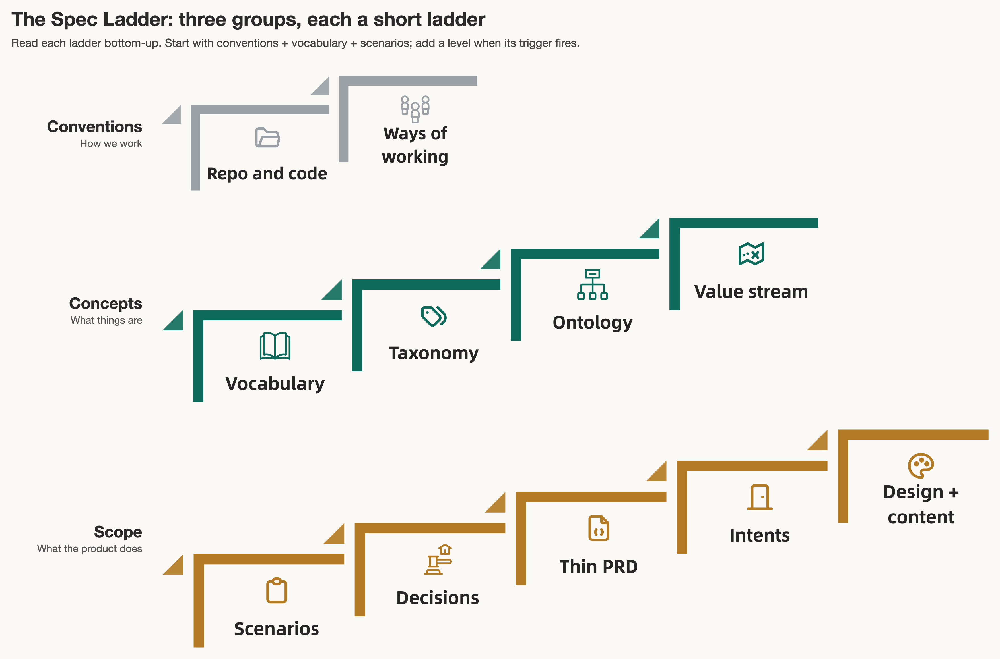

# The Spec Ladder

For product teams whose PRDs, designs, tickets and Slack threads no longer agree, the Spec Ladder is one `spec/` folder of shared truths that people and coding agents build from together. Coding agents amplify whatever we feed them: give them one crisp contract and they produce what we meant, give them five drifting copies of the same feature and they invent the gaps. The spec folder exists so the latest version of the product stays aligned with the latest truths, because every team member, their agents, and the artifacts they produce start from one shared understanding.

The folder sorts into three groups, each a short ladder that starts thin and adds a level only when its trigger fires. **Conventions** are how we work: repo and code conventions first, ways of working as the team grows. **Concepts** are what things are: a shared vocabulary, then a taxonomy, an ontology, and a value stream. **Scope** is what the product does: scenarios first, then decisions, a thin PRD, release intents, and design plus content. Most levels are plain language, so a product manager, a domain expert, or a marketer can read them, correct them, and steer the work without touching code.

**Start reading at the [wiki](https://github.com/dutchdutchdutch/spec-ladder/wiki).** The Home page is the overview; Conventions, Concepts and Scope each have their own page.

In this repo:

- `wiki/` is the published article set. A push to `main` mirrors it to the GitHub wiki.
- `sample/` is a WIP example: a fictional coaching app with a full `spec/` folder, decision records, and scenario-tagged tests.
- `figures/` holds the text sources for the graphics; `tools/figures.sh` renders them.
