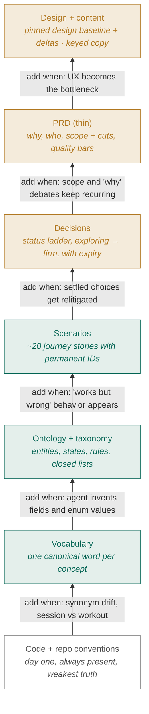
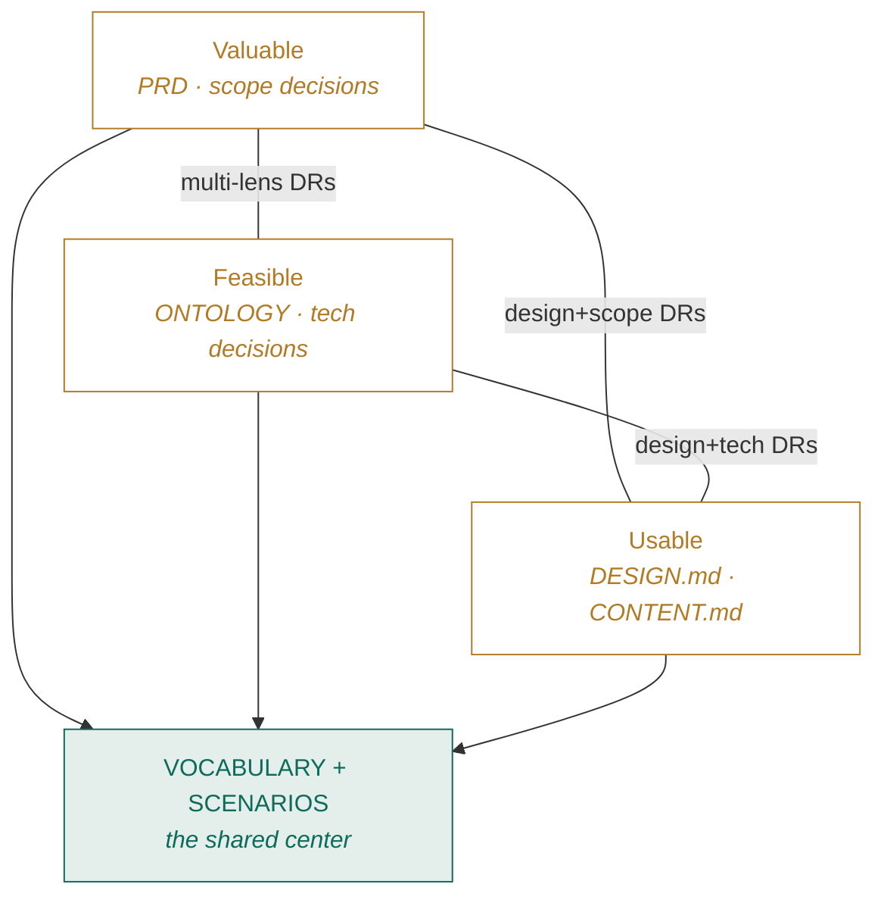

# The Spec Ladder

**We should replace the PRD with one `spec/` folder, layered by kind of truth. Coding agents then build without guessing, and every team member can read, correct, and steer without touching code.**

**The damage comes from what the PRD spawns.** Designs, stories, Slack threads, each a partial copy of the same feature, each drifting from the others. Nobody can say which one is authoritative, so the agent picks one, implements it, and we spend a week debating whether it was the right one.

**The change.** One document per kind of truth. Seven layers, each added when its specific pain shows up. A new area starts with three of them, roughly three pages.

**What's different for you.** Four of the seven layers are plain language and yours to edit. No design file, no dev ticket, no code.

| You are | You edit directly | What it buys you |
|---|---|---|
| **Product** | `SCENARIOS.md` · `decisions/` | Scope debates end in a decision record, not a thread |
| **Marketing / support** | `CONTENT.md` | Every user-facing string is a keyed line you change yourself |
| **Design** | `DESIGN.md` | You absorb small deltas on your cadence, and new patterns still route to you first |
| **Domain expert** | `SCENARIOS.md` · `VOCABULARY.md` | Reading a journey and saying "that's not how it works" is our highest-leverage correction |
| **Dev / tech lead** | `ONTOLOGY.md` · `spec/CLAUDE.md` | Schema and tests generate from the spec, and behavior changes without spec changes bounce |

**The ask.** Open `SCENARIOS.md` in the Stride sample, read three scenarios, and tell us where they're wrong. That's the fastest way to judge whether this structure earns its keep.

---

*Reference below. The full ladder, the design model, and the worked example.*

We're doing a lot of building with coding agents. They're fast, literal, and tireless, so they amplify whatever we feed them. Feed them a crisp contract and they produce what we meant. Feed them multiple overlapping documents and they invent the gaps, implement one variant, and we argue afterward about which one we wanted.

## Drift starts downstream of the PRD

Almost nobody but the author reads a PRD, and neglect is the smaller issue. Teams transcribe the PRD into designs and stories. Every transcription drifts. The corrections land in Slack, where humans can read them and agents can't. Nothing routes back fast enough.

Volume compounds it. When five artifacts describe the same feature, none of them is the source of truth. Prose then fails where it hurts most. One section says "session," the next says "workout." The spec calls for an explicit checkbox on the consent form, and the design shows a slider. Every reader, human or agent, resolves those conflicts differently.

The fix is to split truth by kind, give each kind a home that still governs after release, and add each home only when its specific pain shows up. That's the ladder.

## The ladder

Read bottom-up. Each layer arrives when its trigger fires, never on principle. Every layer costs maintenance, and a stale spec is worse than no spec.



*Teal = machine-checkable contract · Amber = human steering · Outline = always-on base*

> **Start a new area with base + vocabulary + scenarios**, roughly three pages. That alone kills the two biggest agent failure modes: naming drift and invented behavior.

**Seven layers, two or three active at a time.** Nearly all the writing happens in two or three of them at any given point. You read the rest, and reading costs close to nothing.

| Phase | You're writing | You're only reading |
|---|---|---|
| **Framing a new area** | `VOCABULARY` · `SCENARIOS` | Nothing else exists yet |
| **Modeling and build-out** | `ONTOLOGY` · `TAXONOMY` | Scenarios get amended, not rewritten |
| **Getting to a working interface** | `DESIGN` · `CONTENT` · `decisions/` | The contract layers, unchanged |
| **Steady state** | `decisions/` · `SCENARIOS` | Ontology changes are rare, and loud when they happen |

The ladder is a set of homes, not a checklist. You add a home when its pain arrives, then mostly leave it alone.

## What each layer buys

| Layer | The agent gets | You get |
|---|---|---|
| `VOCABULARY` | Deterministic naming, with no synonym guessing | Your own domain words back, at near-zero reading cost |
| `ONTOLOGY` | A generative source for schema, types, validators | A picture of what exists, correctable without reading code |
| `SCENARIOS` | Concrete acceptance targets to verify against | Plain-language stories anyone can veto |
| `decisions/` | Knowledge of where to hold firm and where to explore | Visibility into what's settled, without asking anyone |
| `PRD` | A tiebreaker for intent | The strategic conversation, minus the definitions |
| `DESIGN` + `CONTENT` | The pinned interface contract, plus copy it must never transcribe | Copy edits with no UX on the critical path |

**Read `SCENARIOS.md` first.** An agent can check a scenario against running code. A domain expert can read the same file and say "that's not how it works." No other file in the folder works for both audiences without translation.

## Three concerns, one shared center

Every argument we have reduces to three questions. Is it valuable, is it feasible, is it usable. The layers sort themselves onto that map, and two artifacts sit dead center, read and written by all three concerns.



Shared language and journey stories are the only artifacts all three concerns touch. They're the first layers we add and the last we'd cut. The pairwise edges hold the decision records with two lenses, which are the contested ones.

## Decisions, firm ground and open ground

Teammates and agents share one hard question. What's safe to build on, and what's still in play? One `decisions/` folder answers it, with one file per decision, a permanent ID like `DR-044`, and one field that carries the weight.

**`status`** runs `exploring` → `provisional` → `firm`, with `superseded` for anything replaced. A human promotes a record, and code never does. Provisional records carry an expiry so they can't quietly harden into permanent ones.

Mechanics, including expiry triggers, lenses, and how a record gets reopened, live in **[Decision Records: the operating model]**.

## Design and copy, without bottlenecks

**The design layer holds the interface people meet, and Figma is only one way to hold it.** For UI work it's a set of screens. For an API, an event stream, or a data product, it's the interface contract: an OpenAPI document, a GraphQL schema, `.proto` files, a data contract. An API has a UX too, for the producers and consumers who live in it every day. Either way, `DESIGN.md` points at that artifact and holds the prose it can't carry.

Whatever it points at is a pinned baseline rather than live truth. A contract in the repo pins by commit and costs nothing. Figma needs a named version plus a short delta log in `DESIGN.md`, because it can't be diffed or checked. That one move unlocks three tiers of change.

| Change | Process | Who's involved |
|---|---|---|
| **Copy** | Edit the keyed string in `CONTENT.md`, and git is the log | Product, marketing, and support edit these directly. Legal-owned keys need legal. |
| **Small structural** | Decision record plus one delta line, composed from existing patterns | Anyone proposes, and no UX blocks |
| **New pattern** | Recorded as `exploring`, and UX review is the trigger | UX, on purpose |

Every string carries a key like `data.consent.body`, a status, and an owner. With no screens the strings are error messages, field descriptions, enum labels, and deprecation notices, and support and legal own them for the same reason they own button copy. Text inside the baseline, whether a Figma layer or a sample payload, is illustrative, and agents must never transcribe it. When deltas pile up, the owner absorbs them into the baseline on their own cadence and we re-pin. The loop closes without ever blocking on it.

Contract artifacts by project type, golden payloads, and why stories don't belong on this layer are in **[Design without screens]**.

## What this would change for you

By role, if we adopt it.

**UX.** You own layout, components, interaction, and length constraints, or the equivalent contract shape. You don't own copy. Small changes accumulate as deltas you absorb on your schedule, and new patterns still come to you first. → `spec/training/DESIGN.md`

**Marketing.** You own every user-facing string as a keyed line you edit directly. No design file, no dev ticket for wording. Legal-locked keys are marked. → `spec/training/CONTENT.md`

**Product.** You own the thin PRD, the scenarios, and most decision records, including promotion from exploring to firm. Scope debates end in a DR, not a thread. → `SCENARIOS.md` · `decisions/`

**Devs.** You generate schema, types, and model tests from the ontology. Plans cite scenario IDs and get deleted afterward. When the spec is silent, ask, then write the answer back. → `ONTOLOGY.md` · `spec/CLAUDE.md`

**Tech lead.** You guard the precedence chain and the same-commit rule. Behavior changes without spec changes bounce in review. You decide when a slice earns its next layer. → `spec/CLAUDE.md`

**Domain experts.** You read scenarios written in your vocabulary and say "that's not how it works." That's the highest-leverage steering available to anyone here. → `SCENARIOS.md` · `VOCABULARY.md`

**Customer support.** You get precise bug language from scenario IDs. "SC-014 doesn't hold, I got a duplicate workout" routes itself. You'll also spot missing scenarios before anyone else. → `SCENARIOS.md`

## The sample repo

**Stride**, a fictional coaching app, has every file filled in. The fastest way in is to trace one change end to end. Compliance required explicit consent, and the trail runs through six artifacts, all findable by grepping one ID.

```text
stride-sample/
├── CLAUDE.md                 ← one router line: "read spec/ first"
├── spec/
│   ├── CLAUDE.md             ← the rulebook: read order, precedence, hard rules
│   ├── VOCABULARY.md         ← Athlete, not user/member/client
│   ├── decisions/
│   │   ├── DR-041-…          ← provisional, expires 2026-11-01
│   │   └── DR-044-…          ← firm: consent checkbox  ①
│   └── training/
│       ├── ONTOLOGY.md       ← INV-09: consent required  ②
│       ├── TAXONOMY.md
│       ├── SCENARIOS.md      ← SC-021: the consent story  ③
│       ├── PRD.md            ← thin: why, who, cuts
│       ├── DESIGN.md         ← pins the baseline, holds DR-044 delta  ④
│       └── CONTENT.md        ← data.consent.* keys, legal-owned  ⑤
├── docs/plans/…consent…      ← disposable; cites, never defines  ⑥
└── tests/
    ├── sc-014-…test.ts       ← hand-written, tagged SC-014
    └── derived/inv-07-…      ← generated from the invariant
```

Check `DR-041` while you're in there. It's a decision to onboard by hand instead of building an integration, provisional, with an expiry date. When that date passes, it goes stale loudly instead of quietly becoming permanent.

## Five ground rules

When artifacts disagree, earlier wins.

```text
contracts (VOCABULARY → ONTOLOGY → TAXONOMY → SCENARIOS)
  → firm decisions
  → usable (CONTENT → DESIGN)
  → PRD → plans → code
```

One qualifier inside `usable`. **CONTENT outranks DESIGN on wording, and DESIGN's length and layout constraints bind CONTENT.** A string that busts a 40-character constraint isn't winning a precedence fight. It's non-compliant, the same way a scenario contradicting an invariant is.

Five rules hold the whole thing up.

1. **No noun outside the vocabulary.** A missing term is a question, not an invitation.
2. **IDs are permanent.** `SC-021` and `DR-044` mean the same thing forever.
3. **Derive what you can, hand-write what you must.** Rule-restatements are generated, and journeys are authored.
4. **Provisional needs an expiry.** Otherwise it's a permanent decision nobody admitted making.
5. **Same-commit.** A behavior change without its spec change is drift, and it bounces.

Questions, objections, and "that scenario is wrong" are the point. Start with `SCENARIOS.md` and tell us which ones are wrong.
