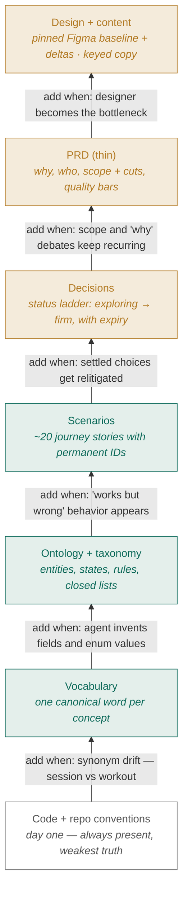
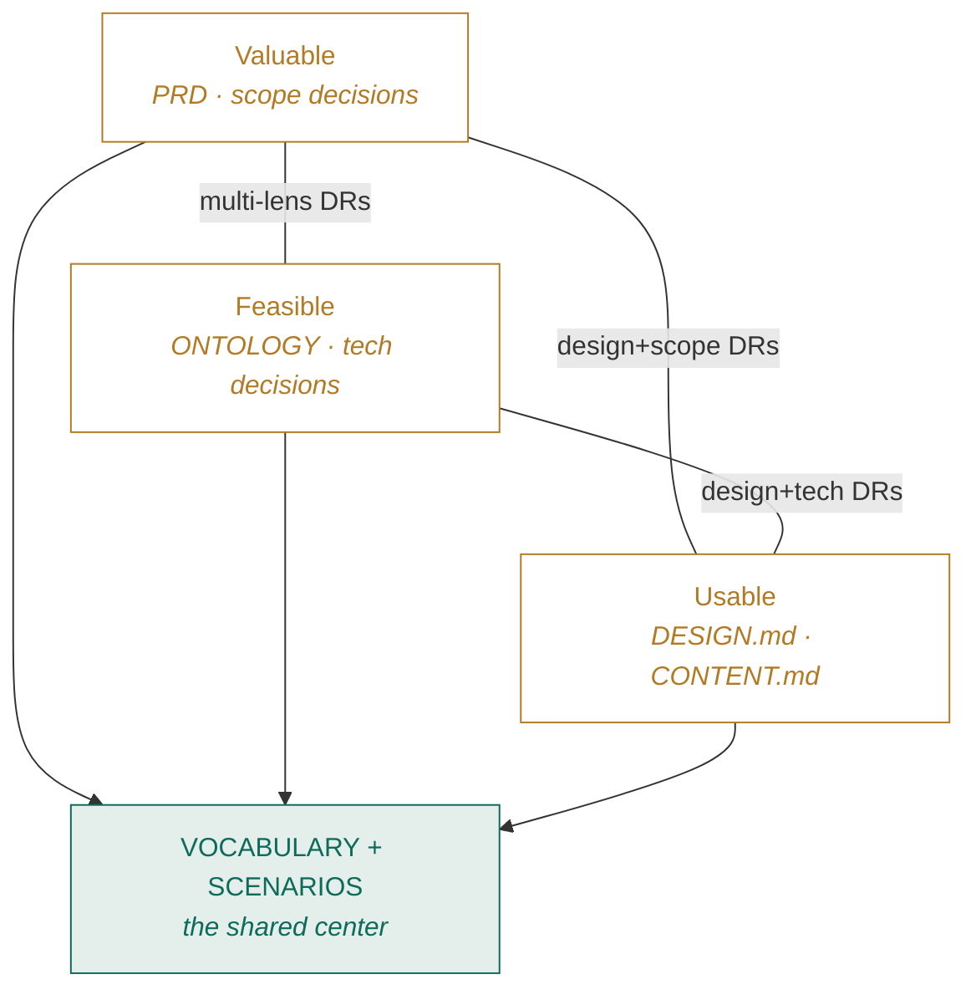
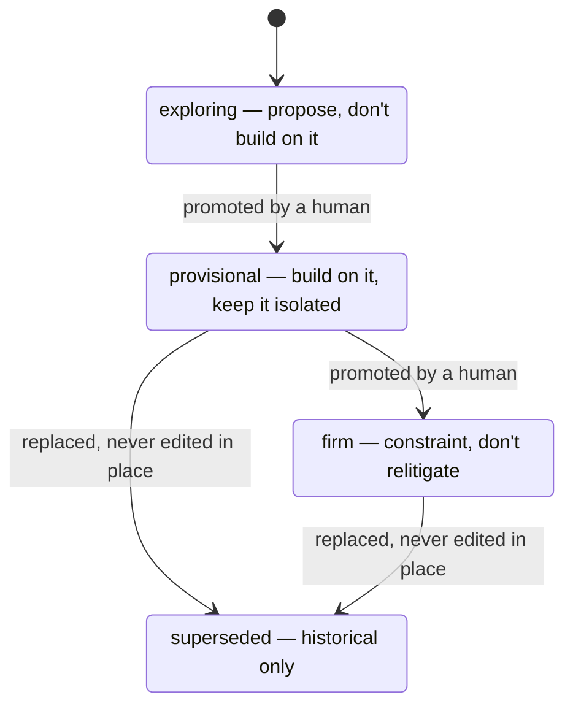

# The Spec Ladder

*One source of truth that coding agents can build from without guessing  and every every team member can read, correct, and steer without touching code.*

We're doing a lot of building with coding agents. Agents are fast, literal, and tireless. Which means they amplify whatever we feed them. Feed them a crisp contract and they produce exactly what we meant. Feed them multiple overlapping and contradictory documents and they invent the gaps, then they implement one of the variants and we spend a week debating whether that was the right one.

This post suggests a structure of small, layered spec documents in a `spec/` folder to try, each owning one kind of truth.

## Why not one big PRD?

PRDs are rarely read by others than the author. Transcribing PRDs into designs and stories can create drift, updates and questions are captured in slack for human comprehension but those don't make it back to the agent fast enough. Plus the size of each artifacts creates confusion about the source of truth, and prose is ambiguous in exactly the ways that hurt: one section says "session," another says "workout," the spec says explicit checkbox on the consent form the design has a slider and every reader, human or agent, resolves these conflicts differently.

The fix is to split the truth by *kind*, give each kind a home that stays load-bearing after release, and add each home only when its specific pain shows up. That's the ladder.

## The ladder

Read bottom-up: each layer is added only when its trigger fires, never on principle. Every layer carries a maintenance cost, and a stale spec is worse than none.



*Teal = machine-checkable contract · Amber = human steering · Outline = always-on base*

> **The minimum viable start** for a new area is just *base + vocabulary + scenarios* — roughly three pages. That already kills the two biggest agent failure modes: naming drift and invented behavior.

## What each layer buys — for the agent, and for you

| Layer | The agent gets | You get |
|---|---|---|
| `VOCABULARY` | Deterministic naming — no synonym guessing | Your own domain words back; near-zero reading cost |
| `ONTOLOGY` | A generative source for schema, types, validators | A picture of "what exists" you can correct without reading code |
| `SCENARIOS` | Concrete acceptance targets to verify against | Plain-language stories anyone can veto |
| `decisions/` | Knows where to hold firm vs explore | See what's settled without asking anyone |
| `PRD` | Tiebreaker for intent | The strategic conversation, minus the definitions |
| `DESIGN` + `CONTENT` | Pixel truth + copy it must never transcribe | Copy edits with no designer on the critical path |

 **scenarios are the steering sweet spot** — the single place where agent precision and human readability peak together. A domain expert can read a scenario and say "that's not how it should feel" without knowing what an invariant is. If you read only one spec file, read that one.

## Three concerns, one shared center

Everything we argue about falls into three overlapping questions: is it *valuable*, is it *feasible*, is it *usable*. The layers sort themselves onto that map — and two artifacts sit dead center, read and written by all three concerns.



The shared language and the journey stories are the only artifacts all three concerns touch — which is why they're the first layers added and the last we'd ever cut. The pairwise edges are where decision records with multiple lenses live: the contested ones.

## Decisions: separating firm ground from open ground

The hardest thing for both teammates and agents is knowing what's safe to build on versus what's still in play. We solve it with a single `decisions/` folder — one file per decision, permanent ID (`DR-044`), and two fields that do the work.

**`status`** — how settled it is. This answers the only question that matters: *may I change this?*



Two rules the diagram can't show:

- **Promotion is a deliberate human act** — a decision is never promoted because the code now depends on it.
- **Provisional records require an `expires` date or trigger** (e.g. `expires: 2026-11-01`). A provisional decision without one is a permanent decision nobody admitted to making — it's refused at the door. Past its expiry, a record goes stale *loudly*: surfaced, not silently honored.

**`lens`** — who cares about it: `scope` · `technical` · `design` · `operational` · `experimental`. Lenses are tags for filtering and knowing whom to ask; they carry no authority. Only `status` does. And every record ends with one load-bearing line: *what would change my mind* — the observable condition that reopens it.

## Design and copy, without bottlenecks

The design docs (Figma or other Prototype) are a **pinned baseline**, not live truth. We reference a named version; current design truth = that baseline + a short delta log in the spec. That one move unlocks three tiers of change:

| Change | Process | Who's involved |
|---|---|---|
| **Copy** | Edit the keyed string in `CONTENT.md`; git is the log | Product, marketing, support — directly. Legal-owned keys need legal. |
| **Small structural** | Decision record + one delta line, composed from existing patterns | Anyone proposes; no designer blocking |
| **New pattern** | Recorded as `exploring`; designer review is the trigger | Designer — on purpose |

Every string in the product has a key (`data.consent.body`), a status, and an owner. Figma text layers are samples; agents are forbidden from transcribing them. When deltas pile up on a frame, the designer absorbs them into Figma on their own cadence and we re-pin — the loop closes without ever blocking on it.

## What changes for you

**Design** — You own layout, components, interaction, and length constraints — not copy. Small changes accumulate as deltas you absorb on your schedule; genuinely new patterns still come to you first. → `spec/training/DESIGN.md`

**Marketing** — Every user-facing string is a keyed line you can edit directly. No design file, no dev ticket for wording. Legal-locked keys are clearly marked. → `spec/training/CONTENT.md`

**Product** — You write the thin PRD and the scenarios, own most decision records, and promote them from exploring to firm. Scope debates end in a DR, not a thread. → `SCENARIOS.md` · `decisions/`

**Devs** — Generate schema, types, and model tests from the ontology. Plans cite scenario IDs and get deleted after. If the spec is silent, ask — then write the answer back. → `ONTOLOGY.md` · `spec/CLAUDE.md`

**Tech lead** — You guard the precedence chain and the same-commit rule: behavior changes without spec changes bounce in review. You decide when a slice earns its next layer. → `spec/CLAUDE.md`

**Domain experts** — Scenarios are written in your vocabulary, on purpose. Reading them and saying "that's not how it works" is the highest-leverage steering anyone can do. → `SCENARIOS.md` · `VOCABULARY.md`

**Customer support** — Scenario IDs give you precise language for bugs: "SC-014 doesn't hold — I got a duplicate workout" routes itself. You'll also spot missing scenarios before anyone. → `SCENARIOS.md`

## Click through: the sample repo

There's a small worked example — **Stride**, a fictional coaching app — with every file filled in. The fastest way to get it is to trace one change end to end: compliance required explicit consent, and the trail runs through six artifacts, all findable by grepping one ID.

```text
stride-sample/
├── CLAUDE.md                 ← one router line: "read spec/ first"
├── spec/
│   ├── CLAUDE.md             ← the rulebook: read order, precedence, hard rules
│   ├── VOCABULARY.md         ← Athlete, not user/member/client
│   ├── decisions/
│   │   ├── DR-041-…          ← provisional, expires 2026-11-01
│   │   └── DR-044-…          ← firm: consent checkbox  ①
│   └── training/
│       ├── ONTOLOGY.md       ← INV-09: consent required  ②
│       ├── TAXONOMY.md
│       ├── SCENARIOS.md      ← SC-021: the consent story  ③
│       ├── PRD.md            ← thin: why, who, cuts
│       ├── DESIGN.md         ← pinned baseline + DR-044 delta  ④
│       └── CONTENT.md        ← data.consent.* keys, legal-owned  ⑤
├── docs/plans/…consent…      ← disposable; cites, never defines  ⑥
└── tests/
    ├── sc-014-…test.ts       ← hand-written, tagged SC-014
    └── derived/inv-07-…      ← generated from the invariant
```

Also worth a look while you're in there: `DR-041` is a decision to do onboarding by hand instead of building an integration — *provisional, with an expiry date*. When that date passes, it goes stale loudly instead of quietly becoming permanent.

## Ground rules, on one hand

When artifacts disagree, earlier wins:

```text
VOCABULARY → ONTOLOGY → TAXONOMY → SCENARIOS → firm decisions → PRD → plans → code
```

And five rules that hold the whole thing up:

1. **No noun outside the vocabulary.** A missing term is a question, not an invitation.
2. **IDs are permanent.** `SC-021` and `DR-044` mean the same thing forever.
3. **Derive what you can, hand-write what you must.** Rule-restatements are generated; journeys are authored.
4. **Provisional needs an expiry.** Otherwise it's a permanent decision nobody admitted to making.
5. **Same-commit.** A behavior change without its spec change is drift, and it bounces.

Questions, objections, and "that scenario is wrong" are exactly the point — that's the steering this structure exists to make cheap. Start with `SCENARIOS.md`.
