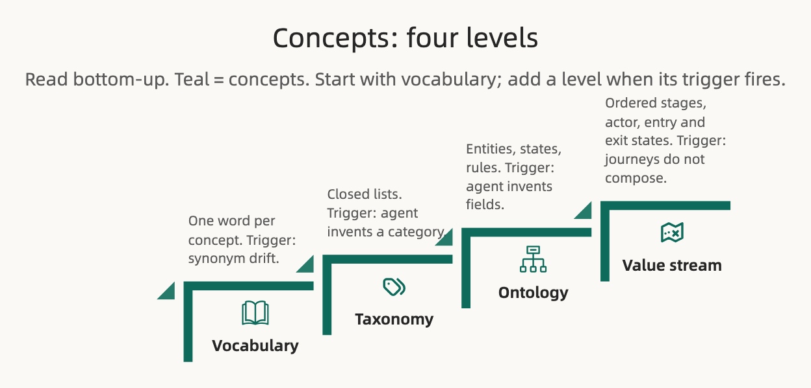

# Concepts

**Concepts are what things are. One word per thing, then categories, then rules, then the order value moves through them.**

Part of *The Spec Ladder* ([[Home]]). Conventions say how we work. Scope says what the product does. This page covers the shared understanding both of them rest on.

## Why this is its own group

Most drift starts as a naming problem. One document says "session", the next says "workout", and every reader, human or agent, resolves the difference their own way. Agents make it worse: a native model knows what a "session" is in general, and that general meaning is wrong for your domain in ways it cannot see. People across disciplines have the same blind spot in different places.

So the first thing a team shares is words. Everything else in this group adds fidelity to those words, and only as far as the domain demands.

## The ladder

| Level | The agent gets | You get | Trigger |
| :-- | :-- | :-- | :-- |
| **Vocabulary** | Deterministic naming, no synonym guessing | Your own domain words back, at near-zero reading cost | Synonym drift: "session" vs "workout" |
| **Taxonomy** | Closed lists it may not extend | The categories in your words, one place to add one | The agent invents an enum value |
| **Ontology** | A generative source for schema, types, validators | A picture of what exists, correctable without reading code | The agent invents fields, states, or rules |
| **Value stream** | Sequencing context: the state of the world before and after what it's building, and which handoffs are deliberately human | The end-to-end map of how value moves, on one page | Journeys don't compose end to end |

## Vocabulary

One canonical word per concept, with a one-line definition and the synonyms it replaces. For a coaching product: Coach, Athlete, Program, Workout, Session. Roughly a page.

Rule one of the whole folder lives here: **no noun outside the vocabulary.** A missing term is a question, not an invitation. That single rule is what lets an agent stop guessing and start asking.

## Taxonomy

The vocabulary sorted into closed lists: workout types, consent kinds, program states. Where the running system reads the list directly, the taxonomy *is* the enum, not a description of it. Adding a category is a one-line change here, and the code follows.

Trigger: the agent, or a new teammate, invents a category that isn't one.

## Ontology

Entities, their states, and the rules that hold between them. An Athlete under 16 has a guardian. A Program cannot publish without at least one Workout. Each entity gets its own small state machine.

This is the level for concepts that are domain-specific and poorly understood by people outside the discipline and by native agents. It is also the least approachable level for non-engineers, which is why it comes third, not first. The ontology earns its generated schema and validators: you cannot read an invariant back out of the function that enforces it.

Trigger: the agent invents a field, a state, or a rule.

## Value stream

One question no other level holds: **in what order does value move through the domain, and who moves it?** For a coaching product: intake → consent → program authored → published → athlete training → outcomes.

**The thinnest form is an ordered list of stages, four facts per stage.** An actor. Entry and exit conditions written as ontology states, never prose. The scenario IDs that anchor the stage. And the kind of investment and return per stage, coarse weights only, so a PM or an agent can say why one change is worth more than another. Roughly twenty lines per slice.

Three things are net new here; everything else already has a home:

1. **Cross-entity order.** The ontology gives each entity its own state machine. The stream composes them end to end.
2. **The actor at each handoff.** No entity owns "a human does this step by hand." The stream shows *where* a deliberate manual step sits; a decision record says *why and until when*.
3. **Scenario completeness.** A stage or handoff with no anchoring scenario is a visible gap instead of a silent one.

What stays out keeps it thin: observed metrics belong on dashboards, targets go in the PRD, per-entity states stay in the ontology, and step-by-step detail stays in scenarios.

One binding rule makes it checkable: **entry and exit conditions must be ontology states.** An agent can then verify every stage boundary is reachable, no state is orphaned, and stage order agrees with the legal transitions.

The stream changes on a one-to-three-year cadence, so it is kept true by attestation, not same-commit. See [[Conventions]].

Triggers: scenarios accumulate but nobody can say how they compose. "What happens between X and Y" keeps recurring. A human handoff is invisible to the people building around it.

## Who edits this group

Business owners and domain experts own the vocabulary and the value stream. "That's not what we call it" and "there's a whole stage missing" are the corrections that pay off most. Devs own the ontology and taxonomy, and generate schema, types and model tests from them. Nobody hand-copies any of it into a second place.
