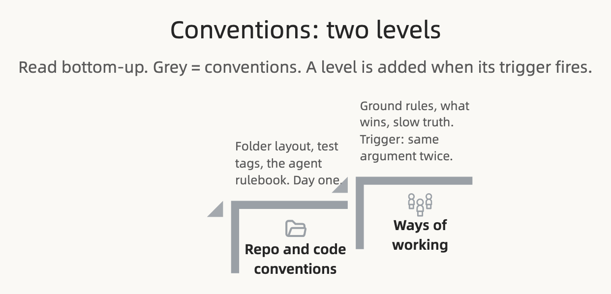

# Conventions

**Conventions are how we work. They are not truth about the product; they govern how the other two groups change.**

Part of *The Spec Ladder* ([[Home]]). Concepts say what things are. Scope says what the product does. This page covers the rules both of them run on.

## Why this is its own group

A three-person team needs almost no written conventions. Everyone sits in the same room, and the repo is the convention. At eight people across three disciplines, the room is gone, and the agents each person runs never had it. What was tacit has to be written down or it is re-argued weekly.

So conventions evolve with team complexity. Start with the repo. Add a ways-of-working rule when the same friction shows up twice. Retire a rule when the friction it solved no longer exists. Conventions are the one group where a shrinking file is a healthy sign.

## The ladder

**Repo and code conventions** are present on day one. No trigger; it is just the repo.

**Ways of working** are added as friction repeats. Trigger: the same argument about process happens twice.

## Repo and code conventions

**Folder layout.** `spec/` holds what more than one discipline has to agree on. `docs/` holds what one discipline keeps as its own working truth: architecture decision records, plans, runbooks. The folder boundary is the discipline boundary. Latency budgets, throughput, uptime, threat models, coverage targets and the architecture are engineering's to set and meet. They live under `docs/`, referenced from `spec/CLAUDE.md`, never folded into `spec/`.

**Tests carry scenario IDs.** A test that anchors a scenario is tagged with its `SC-###`. Support can then say "SC-014 doesn't hold" and the failing test is one search away.

**Plans are disposable.** A plan under `docs/plans/` cites scenario IDs, guides one change, and is deleted after it ships. Git is the history.

**`spec/CLAUDE.md` is the rulebook agents read first.** It states the read order, the precedence chain, the hard rules and the file responsibilities in the terse form an agent needs. This page is the argument; that file is the contract. When they disagree, fix both in the same commit.

## Ways of working

### What wins when documents disagree

Concepts win on meaning. Scope wins on behaviour. Inside a group, the thinner level wins: vocabulary beats ontology, scenarios beat the PRD. Plans and code never win. One qualifier inside Scope: **content outranks design on wording; design's length and layout constraints bind content.** A string that busts a 40-character limit is not winning a precedence fight, it is non-compliant, the same way a scenario contradicting an invariant is.

### Five rules

1. **No noun outside the vocabulary.** A missing term is a question, not an invitation.
2. **IDs are permanent.** `SC-021` and `DR-044` mean the same thing forever.
3. **Derive what you can, hand-write what you must.** Rule restatements are generated. Scenarios are authored.
4. **Provisional needs an expiry.** Otherwise it's a permanent decision nobody admitted making.
5. **Same-commit.** A behaviour change without its spec change is drift, and it bounces.

Rule three has a sharper edge. **Where the running system reads the artifact directly, the level *is* that file**, not a description of it. The taxonomy doesn't describe the enums, it is the enums. The content bundle doesn't describe the strings, it is the bundle the product ships. Generation is right only when the runtime artifact is a different shape: the ontology earns its generated schema and validators, because you cannot read an invariant back out of the function that enforces it. Same fact in a second place is drift, even when a build step keeps the copy honest.

### Who may change what

Review belongs to engineers. Authorship doesn't. A change to any plain-language level by a product manager, a marketer, or a designer is an ordinary pull request, reviewed by a dev and merged in minutes. The gate is the pull request, not the ticket queue. A rejected pull request is faster, cheaper feedback than a ticket nobody picked up.

Promotion is always a human act. A decision goes firm, a content key goes firm, a scenario goes active because a named person said so, never because code came to depend on it or because it has been in production for a while.

The tech lead guards these rules in review and decides when a slice earns its next level. An unowned trigger admits the level by default.

### Keeping slow truth true

Same-commit was built for fast-moving truth. Some levels change on a one-to-three-year cadence: the value stream, a firm decision with no expiry, a pinned design baseline. For those, "untouched for weeks" is not staleness, and the same-commit rule never fires.

Slow levels get **attestation** instead. A named owner re-confirms the level on a fixed cadence, quarterly is a sane default, and within 14 days of any declared transition: a pricing change, a new segment, a pivot, a reorg. Staleness means a missed attestation, never mere non-editing. During a declared transition the level auto-demotes to *under review*, non-binding until re-attested, because a binding, stable, wrong artifact misleads with full authority.

## What to do with this

If you are starting a repo: write `spec/CLAUDE.md` with the folder layout and the five rules, and stop there.

If you are the tech lead: when the same process argument happens twice, write the rule here, and delete rules whose friction is gone.

If you are an agent: read `spec/CLAUDE.md` first, cite IDs, and when the spec is silent, ask, then write the answer back in the same change.
