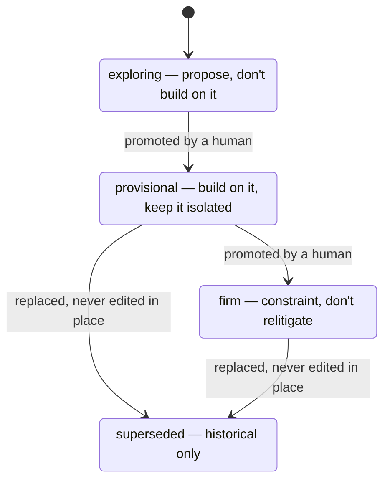

# Decision Records: The Operating Model

**One field carries all the authority: `status`. It answers the only question a teammate or an agent actually has — may I change this?**

Companion to *The Spec Ladder*. That post covers where truth lives. This one covers how settled it is. Copy runs the same promotion rule with two states — see [[Content: Working Truth vs Firm Truth|Content-Operating-Model]].

## The four statuses



| Status | Licenses | Forbids |
|---|---|---|
| `exploring` | Proposing it, arguing it, prototyping it | Building on it |
| `provisional` | Building on it | Coupling to it — keep the blast radius small |
| `firm` | Citing it as a constraint | Reopening it without the stated trigger |
| `superseded` | Reading it for history | Acting on it |

## Two rules that do the work

**Humans promote; code never does.** A decision is not firm because the implementation now depends on it. Dependency is an argument *for* promotion, made by a person, in the record. Accumulated code is not consent — that's how teams end up defending choices nobody remembers making.

**Provisional requires an expiry.** A date (`expires: 2026-11-01`) or a trigger (`expires: when the second enterprise customer onboards`). A provisional record without one is refused at the door: it's a permanent decision nobody admitted to making. Past its expiry, the record goes stale *loudly* — surfaced for review, never silently honored.

## Lens: filtering, not authority

`scope` · `technical` · `design` · `operational` · `experimental`

Lens tells you whom to ask and lets you filter the folder. It grants nothing. A `design` record and a `technical` record at the same status are equally binding, and no lens gives its owner a veto over the others.

Records carrying two lenses are the contested ones — where valuable, feasible, and usable collide. Expect the longest context sections there.

## The line that makes "don't relitigate" survivable

Every record closes with **what would change my mind**: an observable condition, not a sentiment.

- Weak: *if this becomes a problem.*
- Strong: *if manual onboarding exceeds four hours per customer.*

Firm decisions aren't permanent. They're closed until a stated condition fires. That distinction is what lets us refuse relitigation without going rigid — the reopening path is written down in advance, by the people who made the call.

## Record anatomy

```markdown
# DR-044: Explicit consent checkbox on data sharing

status: firm
lens: design, operational
expires: —
supersedes: —

**Decision.** One or two sentences. What we're doing.
**Context.** Why this came up now, and what we considered.
**What would change my mind.** The observable condition that reopens it.
```

Superseded records add `superseded-by: DR-051` and are **never edited in place**. The original text stays intact — a rewritten decision destroys the only trail explaining why the current one exists.

## Failure modes to watch

- **Silent hardening.** Provisional with no expiry, quietly load-bearing eighteen months later.
- **Promotion by inertia.** Nobody objected, so it's firm. Silence isn't a promotion — a named person is.
- **Editing in place.** Convenient, and it erases the history the folder exists to hold.
- **Lens as veto.** "That's a technical decision." Lens tags the reader, not the owner.
- **Records for everything.** A DR is for choices that will otherwise get relitigated. Reversible, uncontested calls belong in the code.

## What to do with this

If you write decision records: use the anatomy above verbatim, and refuse your own provisional records that arrive without an expiry.

If you read them: filter by lens to find yours, trust `status` and nothing else, and when you want a firm decision reopened, argue against the *what would change my mind* line rather than the decision itself. That's the door it was built with.
