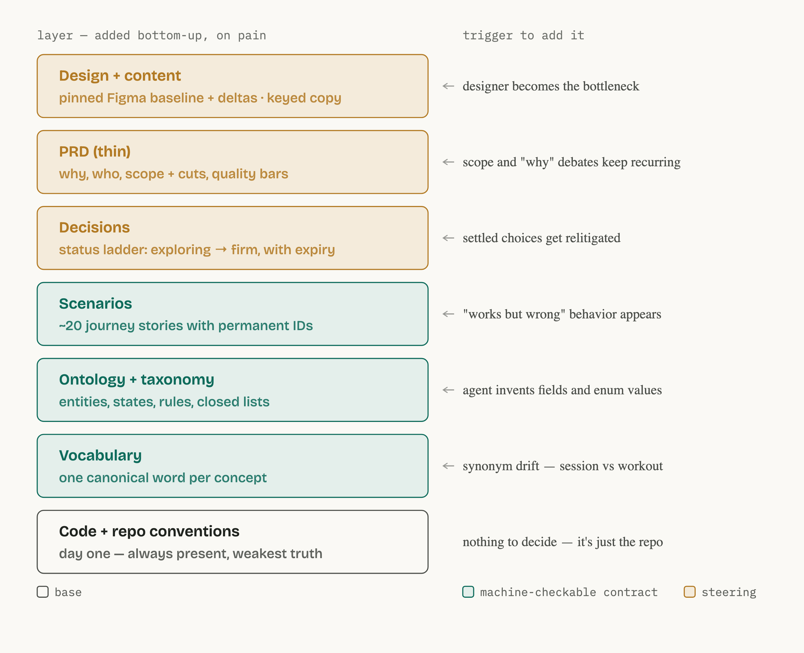
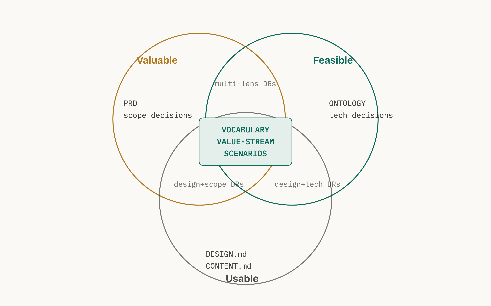

# The Spec Ladder

**Problem: Source of truth confusion** kills team momentum which kills confidence, the remediations often cause more drift in debt beyond the codebase, in design, in specs, in PRDs, etc.

Coding agents are literal, and tireless, which means they amplify whatever we feed them. Feed them a crisp contract and they produce what we meant. Feed them multiple overlapping documents and they invent the gaps.

**Proposal: one `spec/` folder, layered by kind of truth** so coding agents build without guessing, and every team member can read, correct, and steer without touching code.

**Root cause: PRDs spawn** Designs, Stories, test Cases Slack threads. Each a partial copy of the same feature, each drifting from the others. After a while nobody can say which one is authoritative, so the agent picks one, implements it. And if incorrect, we often spent days till the drift is uncovered and hours debating which source is the right one.

**The change.** One document per kind of truth. Eight layers, each added only when its specific pain shows up. A new major use case, component or feature, starts with three of them. Conventions, Vocabulary, and Scenarios; roughly three pages.

**What's different for you.** Five of the eight layers are plain language and yours to edit — no design file, no dev ticket, no code. The by-role breakdown is at the [end of this page](#what-this-might-change-for-you).

---

## The problem is drift, not the PRD

PRDs are rarely read by anyone but the author — and neglect is the smaller issue. The PRD gets transcribed into designs and stories, every transcription drifts, and the corrections land in Slack, legible to humans and invisible to agents. Nothing routes back fast enough.

Volume compounds it. When five artifacts describe the same feature, none of them is the source of truth. And prose is ambiguous exactly where it hurts: one section says "session," the next says "workout." The spec calls for an explicit checkbox on the consent form; the design shows a slider. Every reader, human or agent, resolves those conflicts differently.

The fix: split truth by *kind*, give each kind a home that stays load-bearing after release, and add each home only when its specific pain shows up. That's the ladder.

## The ladder

Read bottom-up. Each layer arrives when its trigger fires, never on principle. Every layer costs maintenance, and a stale spec is worse than no spec.



*Teal = machine-checkable contract · Amber = human steering · Outline = always-on base*

> **Start a new area with base + vocabulary + scenarios** — roughly three pages. That alone kills the two biggest agent failure modes: naming drift and invented behavior.

## What earns a rung — and what doesn't

**The ladder holds what more than one discipline has to agree on.** That is the whole test. A bigger, longer-lived solution needs more rungs because more people have to stay aligned on it — never because the engineering got harder. Anything only one discipline ever has a view on belongs in that discipline's own area, not on the ladder.

So **non-functional requirements are not a rung, and never become one.** Latency budgets, throughput, uptime, threat models, coverage targets, and the architecture that meets them are engineering's to set and engineering's to meet. They live in architecture decision records under `docs/`, next to plans — referenced from `spec/CLAUDE.md`, never folded into the layers. The folder boundary is the discipline boundary: `spec/` is what we have to agree on together, `docs/` is where a discipline keeps its own working truth.

Most of what gets filed as "non-functional" splits on inspection, and doing the split beats dumping the whole list in one place. *Works offline* is a scenario. *Consent uses legal's exact wording* is a content key with `owner: legal`. *Usable one-handed* is a design constraint. What's left — *sync completes within 30 seconds* — is the real budget, and only that goes to the ADR.

**The test: a scenario asks whether the capability happened; a budget asks how well, under what load, and how safely.** The first you can see in a single run. The second needs a measurement regime, and a measurement regime is not something a domain expert can veto by reading it.

## What each layer buys

| Layer | The agent gets | You get |
| :---- | :---- | :---- |
| `VOCABULARY` | Deterministic naming — no synonym guessing | Your own domain words back, at near-zero reading cost |
| `ONTOLOGY` | A generative source for schema, types, validators | A picture of what exists, correctable without reading code |
| `VALUE-STREAM` | Sequencing context — the state of the world before and after what it's building, and which handoffs are deliberately human | The end-to-end map of how value moves, on one page |
| `SCENARIOS` | The functional done criteria to build and verify against | Plain-language stories anyone can veto — one per capability |
| `decisions/` | Knowledge of where to hold firm and where to explore | Visibility into what's settled, without asking anyone |
| `PRD` | A tiebreaker for intent | The strategic conversation, minus the definitions |
| `DESIGN` + `CONTENT` | Pixel truth, plus copy it must never transcribe | Copy edits with no designer on the critical path |

**Scenarios are the steering sweet spot** — the one place where agent precision and human readability peak together. A domain expert reads a scenario and says "that's not how it should feel" without knowing what an invariant is. Read one spec file, read that one.

**Scenarios carry "done."** A capability is done when its scenarios pass — not when the ticket closes, and not when the demo looks right. That is the layer's real job, and it pairs with the one below: **decisions define what's settled; scenarios define what's done.** Both bind the moment a named person promotes them.

The unit is the capability, not the test case: one anchor per major use case, which is what keeps the count low enough to read. Resist writing a scenario per validation rule — those derive from the ontology. This is not the team's story-level definition of done, which is one checklist applied to every ticket; these are the criteria for one capability, different every time. And it is *functional* done: did the capability happen, for this user, with this result. How fast, under what load, and how safely has a different home.

**Scenarios set the floor, not the ceiling.** They name the behaviours that must hold and anchor the integration and end-to-end coverage — roughly twenty per slice, which is what keeps them readable. They are not the test plan. An agent covers far more than the anchors, and how thoroughly it covers — the mix of unit, component, and contract tests, the coverage we hold to — follows from the architecture and belongs with the engineering decisions. That work matters; it just solves a different problem. Mix the two and the one file everyone actually reads stops being readable.

## The value stream: the spine between ontology and scenarios

One step, one question no other layer holds: **in what order does value move through the domain, and who moves it?** For us: intake → consent → program authored → published → athlete training → outcomes.

**The thinnest form is an ordered list of stages, four facts per stage.** An actor. Entry and exit conditions written as ontology states, never prose. The scenario IDs that anchor the stage. And the investment and return per stage: classic value stream mapping counts only time, but in the AI age compute, inference, and availability carry cost too — so we say *investment, with time as the prime example*, and the return is the value exchanged. Kinds and coarse weights only, never measured magnitudes. Roughly twenty lines per slice.

The investment column is what makes the stream a prioritization tool: it lets a PM or an agent answer *why this roadmap or implementation choice is more valuable than that one* — which stage it cheapens, which return it grows.

That thinness is possible because only three things are net new here — everything else already has a home:

1. **Cross-entity order.** The ontology gives each entity its own state machine; the stream composes them end to end. No entity owns the sequence.
2. **The actor at each handoff.** No entity owns "a human does this step by hand." The stream does — our concierge intake stage points at DR-041 and inherits its expiry. The stream shows *where* the deliberate waste sits; the decision record says *why and until when*.
3. **Scenario completeness.** Scenarios zoom in on stages and transitions. A stage or handoff with no anchoring scenario becomes a visible gap instead of a silent one — and the stream is what tells us which journeys count as primary in the first place.

What stays out keeps it thin. Observed metrics — cycle times, wait times, waste percentages — belong on dashboards, not in spec; a stream quoting last month's numbers is stale by next month, and a stale spec teaches everyone the folder lies. Targets go in the PRD. Per-entity states stay in the ontology. Journey detail stays in scenarios.

One binding rule makes it checkable instead of a wall poster: **entry and exit conditions must be ontology states.** An agent can then verify every stage boundary is reachable, no state is orphaned outside the stream, and stage order agrees with the legal transitions.

Trigger to add it: scenarios accumulate but nobody can say how they compose end to end; "what happens between X and Y" keeps recurring; a human handoff is invisible to the people and agents building around it; or prioritization arguments recur that the ontology cannot settle. The tech lead owns that judgment, as with every layer — an unowned trigger admits the layer by default.

**Slow truth is kept true differently.** A value stream changes on a one-to-three-year cadence, so the same-commit rule — built for fast-moving truth — never fires on it, and "untouched for weeks" is not staleness. Slow layers get **attestation** instead: a named owner re-confirms the stream quarterly, and within 14 days of any declared transition (pricing change, new segment, pivot, reorg). Staleness means a missed attestation, never mere non-editing. And during a declared transition the layer auto-demotes to *under review* — non-binding until re-attested — because a binding, stable, wrong artifact misleads with full authority.

## Three concerns, one shared center

Every argument we have reduces to three questions: is it *valuable*, is it *feasible*, is it *usable*. The layers sort themselves onto that map. Three artifacts sit dead center, read and written by all three concerns.



Shared language and journey stories are the first layers we add and the last we'd cut. The value stream joins them at the center once its trigger fires — product reads it for what value flows, devs for the states that bound each stage, design for the journey users actually travel. The pairwise edges hold the decision records with multiple lenses: the contested ones.

## Decisions: firm ground vs. open ground

Teammates and agents share one hard question: what's safe to build on, and what's still in play? One `decisions/` folder answers it — one file per decision, a permanent ID (`DR-044`), and one field that carries the weight.

**`status`** runs `exploring` → `provisional` → `firm`, with `superseded` for anything replaced. Promotion is always a human act, and provisional records carry an expiry so they can't quietly harden into permanent ones.

Most records are single-lens and unremarkable — an engineering call carrying a `technical` lens, which is the architecture decision record by another name. Those are the bulk of the folder and nobody outside engineering needs to read them. Keep the folder for choices that would otherwise get relitigated: a coverage target nobody argues about is convention, and belongs in `spec/CLAUDE.md`.

Mechanics — expiry triggers, lenses, and how a record gets reopened — are in [[Decision Records: The Operating Model|Decision-Records-Operating-Model]].

## Intents: the front door

The ladder says where truth lives. It never said how work gets in. So a raw idea has nowhere to land, it lands in a thread, and whoever read the thread transcribes the parts they remember into layers.

One `intents/` folder is the front door. **One file per release, answering the question no layer holds: what is in this release, what is deliberately out, and why.**

**Zero authority, permanent storage.** An intent is not a ninth layer. It never appears in the precedence chain and never wins a conflict. Agents read it for context and may never cite it as truth. But we keep the file forever, the way we keep a changelog entry — what a release chose costs nothing to store and is expensive to reconstruct later.

**The thinnest form is four parts.** One paragraph of intent, in the originator's own words — what this release is for. An *in* list, where each item names the layer edits it lands as. An *out* list, one line of reason each. And the open questions, each already filed as a `DR-###` in `exploring`.

The *out* list is the part with no other home. A large exclusion earns a decision record. Small scope cuts don't, so today they live in a thread and are gone by the next release — and "why didn't we do X" gets re-argued from scratch. The out list catches them at the one moment anyone still remembers the answer.

**An intent indexes; it never copies.** "This release changes PRD §3, `SC-021` through `SC-024`, and four content keys" — pointing at the current documents. The moment an intent restates what a layer says, it becomes another partial copy, drifting, which is the thing the whole folder exists to prevent.

That rule has a corollary, because the instinct runs the other way: **no per-release update sections inside `PRD`, `DESIGN`, or `CONTENT`.** A layer's body is always current truth, and git is the release history. Append a "v2.3 changes" section and the top of the file disagrees with the bottom; every reader has to replay the sections in order to work out what holds now, and an agent takes the first match and runs. (DESIGN's delta log looks like a counter-example and isn't — it bridges to Figma, which can't be edited in the same commit, and it shrinks to zero each time the designer re-pins.)

**Root folders fork only when truth forks.** A `spec/v2/` earns its place when two versions must be true at the same time — v1 and v2 both in production, an API inside its deprecation window. If everyone moves at once, that's a commit, not a folder.

Trigger to add it: scope decisions get re-argued across releases; "why didn't we do X" keeps recurring; or work arrives from outside the team — a support escalation, a production alert, a compliance change — with nowhere to land before someone decides which layers it touches.

## Design and copy, without bottlenecks

Figma or another prototype is a **pinned baseline**, not live truth. We reference a named version; current design truth = that baseline plus a short delta log in the spec. That single move unlocks three tiers of change:

| Change | Process | Who's involved |
| :---- | :---- | :---- |
| **Copy** | Edit the keyed string in the content bundle; git is the log | Product, marketing, support — directly. Legal-owned keys need legal. |
| **Small structural** | Decision record plus one delta line, composed from existing patterns | Anyone proposes; no designer blocking |
| **New pattern** | Recorded as `exploring`; designer review is the trigger | Designer — on purpose |

Every string in the product carries a key (`data.consent.body`), a status, and an owner, and lives in the source-language content bundle — the file the product actually reads. The spec artifact and the runtime artifact are the same file, so there is no version of the string to drift against. Figma text layers are samples, and agents are forbidden from transcribing them. When deltas pile up on a frame, the designer absorbs them into Figma on their own cadence and we re-pin. The loop closes without ever blocking on it.

Copy itself is collaborative — marketing sets tone, design sets register, a copywriter drafts, product owns the hard strings — and every shipped tweak rides the full pipeline, so churn is expensive. The key's `status` carries the distinction: `working` copy ships but is expected to change and batches into sweeps; `firm` copy changes only through its owner. The full model is in [[Content: Working Truth vs Firm Truth|Content-Operating-Model]].

## Everyone builds

Reading the spec is half of it. **A layer earns its maintenance only if the people who own it can change it** — and a change by a product manager, a marketer, or a designer is an ordinary pull request.

A ticket records that a change was wanted. It should not be the only channel. When it is, every discipline's small changes serialise into a single engineering queue, and engineers pay a context-switching tax on work that was never engineering work. A three-word copy fix waits two sprints behind a migration, and by the time it lands nobody remembers why it was raised.

**Small changes get to stay small.** A word of copy is one key in the content bundle. A button variant is one delta line in `DESIGN.md`. A missing stage is a few lines in `VALUE-STREAM.md`. Each is a pull request — reviewed by a dev, merged in minutes, landing *in* the source of truth instead of beside it. The cost of the change stays proportional to the change, which is the only reason small changes get made at all.

**You don't need git.** Describe the change to an agent — in Linear, in the terminal, wherever the work already lives — or point one at an existing issue. The agent opens the pull request. The bar drops from "can edit markdown on a branch" to "can say what should be different."

**The harness is the precondition, and the layers are the harness.** An agent taking changes directly has to know which changes it may take. Devs set that up once; the status fields already carry the answer, which is what makes them load-bearing rather than decorative.

| The change touches | The agent may take it | Otherwise it routes to |
| :---- | :---- | :---- |
| A `working` content key | Directly | — |
| A `firm` content key | No | The key's owner — legal-owned keys, legal |
| A delta composed from existing design patterns | Directly, with a decision record | — |
| A new design pattern | No | The designer |
| A scenario, an invariant, or a `firm` decision | No | That layer's owner |

**The repo has to meet the spec halfway.** A copy change is only cheap if the running product reads the string from the content bundle. A variant change is only cheap if the variant is config. Where a fact is hard-coded in a programming language, it is an engineering change however good the spec folder is — **a change costs what its lowest-level representation costs.** Devs own that abstraction, and it is the precondition for everything above it.

What sits outside the folder stays outside: the platform code that consumes the keys, the translations derived from the source bundle, and how each touchpoint renders them. Those answer to engineering and move at its speed. They are not where scope drifts between disciplines.

Review still belongs to engineers. Authorship doesn't. **The gate is the pull request, not the queue** — and a rejected pull request is faster, cheaper feedback than a ticket nobody picked up.

## Ground rules, on one hand

When artifacts disagree, earlier wins:

```
contracts (VOCABULARY → ONTOLOGY → TAXONOMY → VALUE-STREAM → SCENARIOS)
  → firm decisions
  → surfaces (CONTENT → DESIGN)
  → PRD → plans → code
```

One qualifier inside `surfaces`: **CONTENT outranks DESIGN on wording; DESIGN's length and layout constraints bind CONTENT.** A string that busts a 40-character constraint isn't winning a precedence fight, it's non-compliant, the same way a scenario contradicting an invariant is.

`intents/` is absent from the chain on purpose. It records what a release chose, not what is true, so it never resolves a conflict — it points at the layers that do.

Five rules:

1. **No noun outside the vocabulary.** A missing term is a question, not an invitation.
2. **IDs are permanent.** `SC-021` and `DR-044` mean the same thing forever.
3. **Derive what you can, hand-write what you must.** Rule-restatements are generated; journeys are authored.
4. **Provisional needs an expiry.** Otherwise it's a permanent decision nobody admitted making.
5. **Same-commit.** A behavior change without its spec change is drift, and it bounces.

Rule three has a sharper edge worth stating. **Where the running system reads the artifact directly, the layer *is* that file** — not a description of it. `TAXONOMY` doesn't describe the enums, it *is* the enums; `CONTENT` doesn't describe the strings, it is the bundle the product ships. Generation is right only when the runtime artifact is a different *shape*: `ONTOLOGY` earns its generated schema and validators, because you cannot read an invariant back out of the function that enforces it. Same fact in a second place is drift, even when a build step keeps the copy honest.

Questions, objections, and "that scenario is wrong" are the point. Cheap steering is what we're after.

## Where this fits — and where it doesn't

The ladder costs maintenance, and it is not the right shape everywhere. One question sorts it: **can a person who cannot read code confirm that a statement is correct — and change it themselves?**

If not — the domain nouns are the code nouns, engineers write and check the requirements, the truth is readable from the repo — then standing layers just restate the type system. A lighter per-change pipeline fits better, and Anthropic's [AI-native SDLC playbook](https://claude.com/blog/the-ai-native-sdlc-playbook) is a good one: intent → spec → plan → code, each a document for that change, archived once it ships. Internal tooling, platform work, and products still hunting for fit usually sit here.

If so — the truth comes from a statute, a clinical protocol, a pricing rule, or a domain expert's head, and only that person can confirm it — then letting the spec die at ship locks the one qualified reviewer out, and leaves them nothing to edit. That's the ladder's case. Agents sharpen it. They write the tests in either approach, so the question is what those tests check against: a standing statement someone confirmed, or the code and the agent's reading of it. Derive from the code and a bug becomes a requirement — green suite, wrong behaviour, and nobody outside engineering could have caught it.

Most systems are mixed, and the unit is the slice, not the project. Profiles, the seven questions behind them, and a full comparison with the playbook are in [[Where the Ladder Fits|Where-the-Ladder-Fits]].

## What this might change for you

Five of the eight layers are plain language and yours to edit — no design file, no dev ticket, no code.

| You are | You edit directly | What it buys you |
| :---- | :---- | :---- |
| **Product** | `SCENARIOS.md` · `decisions/` · `VALUE-STREAM.md` · `intents/` | Scope debates end in a decision record, not a thread — and cuts stop getting re-argued |
| **Business owner / domain expert** | `SCENARIOS.md` · `VOCABULARY.md` · `VALUE-STREAM.md` | "That's not how it works" — and "there's a whole stage missing" — are our highest-leverage corrections |
| **Marketing / support** | the content bundle | Propose any string freely; confirm the ones you own — `working` vs `firm` marks which is which |
| **Design** | `DESIGN.md` | You absorb small deltas on your cadence; new patterns still route to you first |
| **Dev / tech lead** | `ONTOLOGY.md` · `spec/CLAUDE.md` | Schema and tests generate from the spec; behavior changes without spec changes bounce |

By role, if we adopt it (in an everyone builds environment, one one person may wear multiple hats, and people will share or backfill roles as needed.):

**Design** — You own layout, components, interaction, and length constraints. You don't own copy. Small changes accumulate as deltas you absorb on your schedule; genuinely new patterns still come to you first. → `spec/training/DESIGN.md`

**Marketing** — You set brand tone as a constraint and propose any string freely; the keys you own, you confirm. No design file, no dev ticket for wording. Legal-locked keys are marked. → the content bundle

**Product** — You own the thin PRD, the scenarios, the value stream, and most decision records, including promotion from exploring to firm. You write the release intent, and the *out* list is yours: one line per cut, so nobody re-argues it next quarter. Scope debates end in a DR, not a thread. → `SCENARIOS.md` · `decisions/` · `VALUE-STREAM.md` · `intents/`

**Devs** — You generate schema, types, and model tests from the ontology. Plans cite scenario IDs and get deleted afterward. When the spec is silent, ask — then write the answer back. → `ONTOLOGY.md` · `spec/CLAUDE.md`

**Tech lead** — You guard the precedence chain and the same-commit rule: behavior changes without spec changes bounce in review. You decide when a slice earns its next layer. → `spec/CLAUDE.md`

**Business owners / domain experts** — You read scenarios written in your vocabulary and say "that's not how it works." The value stream gives you the second lever: reading the end-to-end map and saying "there's a whole stage missing between authoring and publishing" — a structural correction no single scenario surfaces. → `SCENARIOS.md` · `VOCABULARY.md` · `VALUE-STREAM.md`

**Customer support** — You get precise bug language from scenario IDs: "SC-014 doesn't hold — I got a duplicate workout" routes itself. The value stream also tells you which stage a complaint lives in. You'll spot missing scenarios before anyone else. → `SCENARIOS.md`
