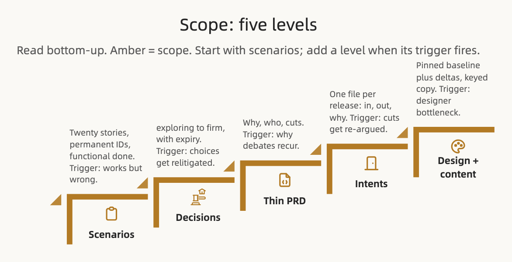

# Scope

**Scope is what the product does. It starts as a list of scenarios and adds detail only where the scenarios leave people and agents guessing.**

Part of *The Spec Ladder* ([[Home]]). Conventions say how we work. Concepts say what things are. This page covers what we are building, in increasing fidelity.

## Why scenarios come before the PRD

Traditional development starts with a product requirements document (PRD). The ladder starts with scenarios. A product manager may still write a PRD early, and should. But it only enters shared truth when the concepts and the scenarios are not enough on their own. Most of a PRD restates definitions the Concepts group already holds and describes behaviour a scenario states more sharply. What is left, the why, the who, the cuts, is thin. So the PRD is a level, not the root.

## The ladder

| Level | The agent gets | You get | Trigger |
| :-- | :-- | :-- | :-- |
| **Scenarios** | The functional done criteria to build and verify against | Plain-language stories anyone can veto, one per capability | "Works but wrong" behaviour appears |
| **Decisions** | Knowledge of where to hold firm and where to explore | Visibility into what's settled, without asking anyone | Settled choices get relitigated |
| **PRD** | A tiebreaker for intent | The strategic conversation, minus the definitions | "Why" and scope debates keep recurring |
| **Intents** | Context for what a release chose | The out list: cuts that stop being re-argued | Scope gets re-argued across releases |
| **Design + content** | Pixel truth, plus copy it must never transcribe | Copy edits with no designer on the critical path | The designer becomes the bottleneck |

## Scenarios

**Scenarios are the steering sweet spot**, the one place where agent precision and human readability peak together. A domain expert reads a scenario and says "that's not how it should feel" without knowing what an invariant is. Read one spec file, read this one.

A scenario is a short description of one capability from one user's point of view, in the vocabulary, with a permanent ID. Less detailed than a story or an epic. "SC-021: An athlete under 16 cannot see a published program until a guardian has given consent."

**Scenarios carry "done."** A capability is done when its scenarios pass: not when the ticket closes, and not when the demo looks right. Decisions define what's settled; scenarios define what's done. Both bind the moment a named person promotes them.

The unit is the capability, not the test case: one anchor per major use case, which keeps the count low enough to read, roughly twenty per slice. Resist writing a scenario per validation rule: those derive from the ontology. And it is *functional* done: did the capability happen, for this user, with this result. How fast, under what load, and how safely has a different home under `docs/`.

**Scenarios set the floor, not the ceiling.** They name the behaviours that must hold and anchor the integration and end-to-end coverage. They are not the test plan. An agent covers far more than the anchors; how thoroughly, at which levels and to what target follows from the architecture and belongs with the engineering decisions.

## Decisions

Teammates and agents share one hard question: what's safe to build on, and what's still in play. One `decisions/` folder answers it: one file per decision, a permanent ID (`DR-044`), and one field that carries the weight.

**`status`** runs `exploring` → `provisional` → `firm`, with `superseded` for anything replaced. Promotion is always a human act, and provisional records carry an expiry so they can't quietly harden into permanent ones.

Decisions log the choices that follow from the other levels: a convention that had to be interpreted, a concept that had two readings, a scenario the PRD wanted cut. Records carrying more than one lens (scope, technical, design) are the contested ones, where valuable, feasible and usable pull against each other. Most records are single-lens and unremarkable, and nobody outside engineering needs to read them. Keep the folder for choices that would otherwise get relitigated: a coverage target nobody argues about is a convention.

The mechanics (expiry, lenses, reopening) are in [[Decision-Records-Operating-Model|Decision Records: The Operating Model]].

## PRD

Thin on purpose: why this, for whom, what is in scope, what is cut, and the quality bars. No definitions, those are Concepts. No behaviour, that is scenarios. When two scenarios seem to want different things and no decision record settles it, the PRD is the tiebreaker for intent. Product owns it, and it stays current: no per-release update sections, git is the release history.

Trigger: "why" and scope debates keep recurring and the scenarios cannot settle them.

## Intents

The ladder says where truth lives. It never said how work gets in. Without a front door, a raw idea lands in a thread, and whoever read the thread transcribes the parts they remember.

One `intents/` folder is the front door. **One file per release: what is in, what is deliberately out, and why.** Four parts: one paragraph of intent in the originator's words. An *in* list, each item naming the level edits it lands as. An *out* list, one line of reason each. And the open questions, each already filed as a `DR-###` in `exploring`.

**Zero authority, permanent storage.** An intent never wins a conflict. Agents read it for context and may never cite it as truth. We keep it forever, the way we keep a changelog entry, because what a release chose is cheap to store and expensive to reconstruct.

**An intent indexes; it never copies.** "This release changes PRD §3, `SC-021` through `SC-024`, and four content keys." The moment it restates what a level says, it becomes another partial copy. The same rule applies to the levels themselves: no "v2.3 changes" sections inside the PRD, design or content. A level's body is always current truth.

The *out* list is the part with no other home. Small scope cuts don't earn a decision record, so today they live in a thread and are gone by the next release. The out list catches them at the one moment anyone still remembers the answer.

Triggers: scope decisions get re-argued across releases. "Why didn't we do X" keeps recurring. Or work arrives from outside the team with nowhere to land.

## Design and content

Figma or another prototype is a **pinned baseline**, not live truth. We reference a named version. Current design truth is that baseline plus a short delta log in `DESIGN.md`. When deltas pile up, the designer absorbs them into Figma on their own cadence and we re-pin. Projects with no screens pin an interface contract instead: [[Design-Without-Screens|Design without screens]].

Every string in the product carries a key (`data.consent.body`), a status, and an owner, and lives in the source-language content bundle, the file the product actually reads. The spec artifact and the runtime artifact are the same file, so there is no version of the string to drift against. Figma text layers are samples, and agents are forbidden from transcribing them. `working` copy ships but is expected to change and batches into sweeps. `firm` copy changes only through its owner. The full model is in [[Content-Operating-Model|Content: Working Truth vs Firm Truth]].

That opens three tiers of change:

| Change | Process | Who's involved |
| :---- | :---- | :---- |
| **Copy** | Edit the keyed string in the content bundle; git is the log | Product, marketing, support, directly. Legal-owned keys need legal. |
| **Small structural** | Decision record plus one delta line, composed from existing patterns | Anyone proposes; no designer blocking |
| **New pattern** | Recorded as `exploring`; designer review is the trigger | Designer, on purpose |

**Small changes get to stay small.** A word of copy is one key. A button variant is one delta line. Each is a pull request, merged in minutes, landing *in* the source of truth instead of beside it. You don't need git: describe the change to an agent and it opens the pull request.

An agent taking changes directly has to know which changes it may take. The status fields carry the answer:

| The change touches | The agent may take it | Otherwise it routes to |
| :---- | :---- | :---- |
| A `working` content key | Directly | — |
| A `firm` content key | No | The key's owner (legal-owned keys go to legal) |
| A delta composed from existing design patterns | Directly, with a decision record | — |
| A new design pattern | No | The designer |
| A scenario, an invariant, or a `firm` decision | No | That level's owner |

**The repo has to meet the spec halfway.** A copy change is only cheap if the running product reads the string from the bundle. A variant change is only cheap if the variant is config. Where a fact is hard-coded, it is an engineering change however good the spec folder is: **a change costs what its lowest-level representation costs.** Devs own that abstraction, and it is the precondition for everything above it.

## Who edits this group

Product owns the scenarios, the PRD, most decision records, and the intent for each release, the out list above all. Domain experts and support veto scenarios; "SC-014 doesn't hold" is a bug report that routes itself. Marketing and support propose any string and confirm the ones they own. Design absorbs deltas on its cadence and sees every new pattern first.
